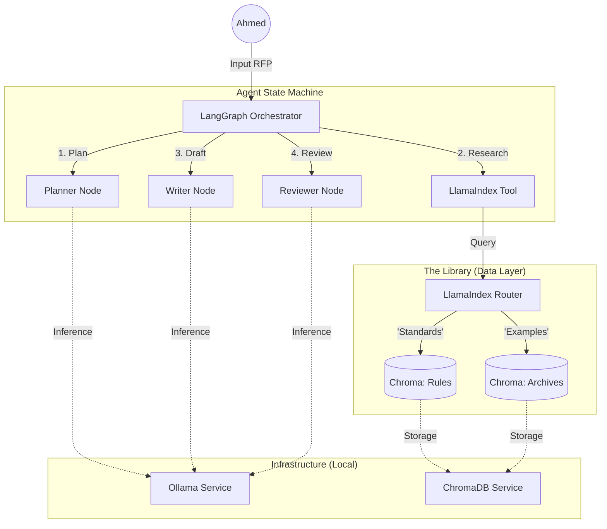

# 🏗️ MIGRATION PLAN: The "Zero-Cost" Engineering Agent

**Date:** January 12, 2026  
**Status:** DRAFT (Ready for Implementation)  
**Architecture Source:** Adapted from `Hiflylabs/langgraph-llamaindex-integration` & `mattialoszach/local-rag`

---

## 1. 🎯 Objective
Transform the static `knowledge_base.json` into a **Local AI Engineering Assistant**.
The system will run 100% offline (Zero Cost) using:
*   **Agent Brain:** LangGraph (State management)
*   **Knowledge Retrieval:** LlamaIndex (PDF/JSON parsing)
*   **Memory:** ChromaDB (Vector Store)
*   **Intelligence:** Ollama (Local LLM)

---

## 2. 🏛️ Architecture Diagram

---

## 3. 🛠️ Implementation Steps

### Phase 1: Infrastructure Setup (The "Hardware")
**Goal:** Get the local servers running.
1.  **Install Dependencies:**
    *   `pip install llama-index llama-index-vector-stores-chroma llama-index-embeddings-ollama`
    *   `pip install langgraph langchain-community langchain-ollama`
2.  **Setup Ollama:**
    *   `ollama pull llama3.1:8b` (General Reasoning)
    *   `ollama pull nomic-embed-text` (Embeddings)

### Phase 2: Data Migration (The "Brain Transplant")
**Goal:** Move `knowledge_base.json` into ChromaDB.
**Script:** `scripts/migrate_kb.py`
1.  **Load JSON:** Read the legacy `knowledge_base.json`.
2.  **Split Data:**
    *   **Collection A (`standards`):** Extract `glossary`, `technical_references`, `api_docs`.
    *   **Collection B (`archives`):** Extract `proposals` and `reports`.
3.  **Embed & Index:**
    *   Use `OllamaEmbedding(model_name="nomic-embed-text")`.
    *   Persist to `./chroma_db`.

### Phase 3: The "Research Tool" (The "Hands")
**Goal:** Create a Python function LangGraph can call.
**File:** `src/tools/research.py`
*   Define `lookup_engineering_data(query: str, type: str)`:
    *   Initializes `VectorStoreIndex` from persistent ChromaDB.
    *   Uses `type` to select "Rules" vs "Archives".
    *   Returns summarized context.

### Phase 4: The Agent Workflow (The "Conductor")
**Goal:** Orchestrate the writing process.
**File:** `src/agent/workflow.py`
*   **State:** `Dict[str, Any]` containing `rfp_text`, `plan`, `draft`.
*   **Nodes:**
    *   `planner`: Breaks RFP into sections.
    *   `researcher`: Calls `lookup_engineering_data` for each section.
    *   `writer`: Synthesizes research into "Technical/Financial Proposal".
*   **Edge:** Loop back to `writer` if `reviewer` finds missing citations.

---

## 4. 🔍 Validation Plan
1.  **Data Check:** Run a query "What is the concrete standard?" -> Expect "ACI 318-25".
2.  **Agent Check:** Input "Generate a proposal for a 5km road in Ras El Hekma".
    *   Expect: Agent retrieves "Ras El Hekma" geography + "Road Design" standards.
    *   Expect: Output DOCX with correct sections.

---

## 5. ⚠️ Known Constraints (Local)
*   **Speed:** Embedding 13 large PDFs might take 10-20 mins initially.
*   **RAM:** Requires ~16GB RAM for smooth Llama 3.1 inference.
*   **Arabic:** `nomic-embed-text` is decent, but `multilingual-e5` might be better if results are poor.